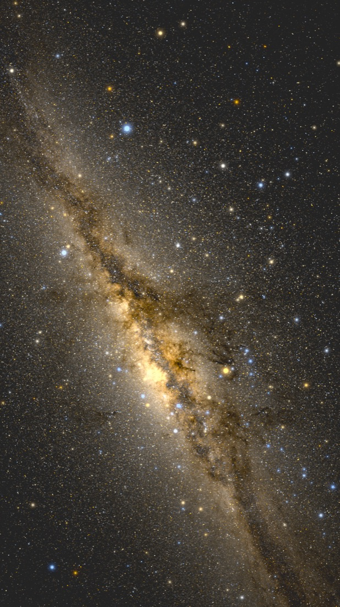
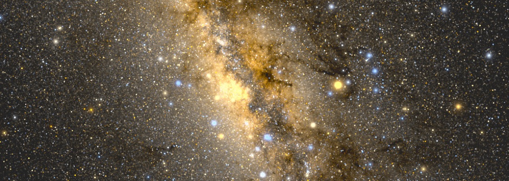
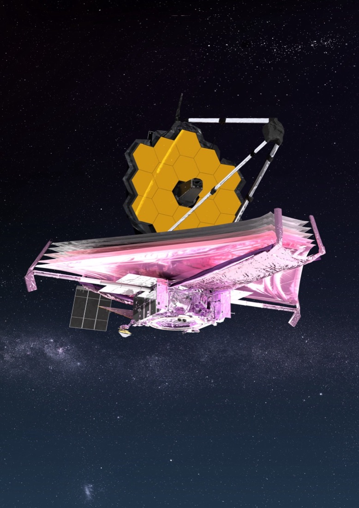
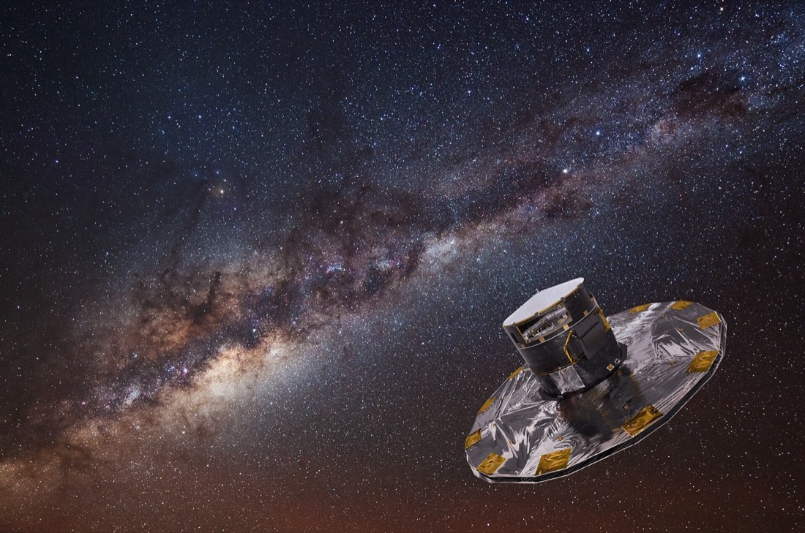
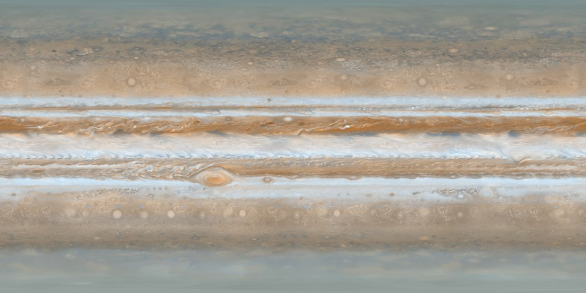
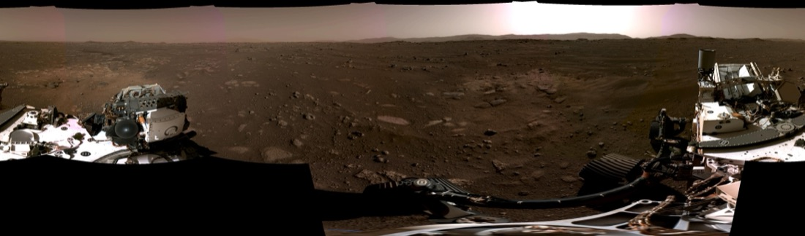
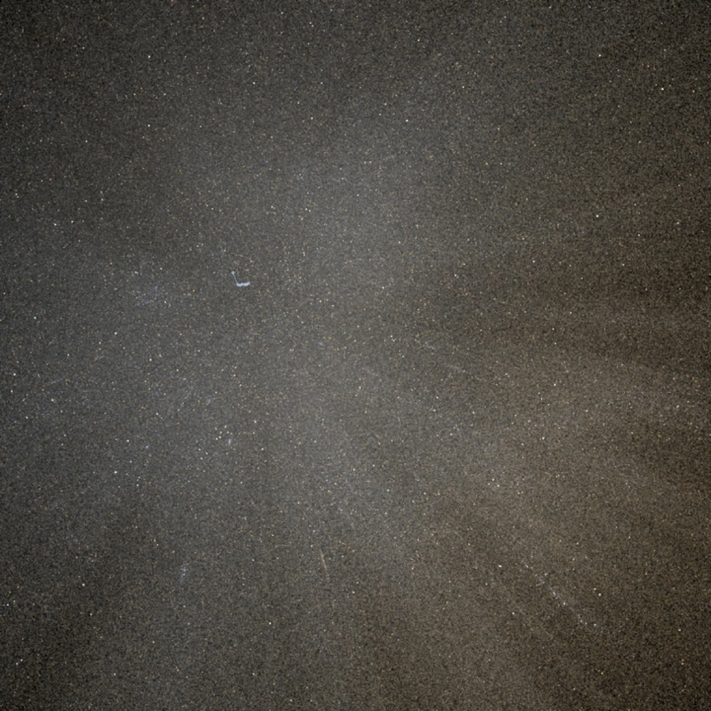

# 三个月前我还不会用，现在它上线了

> 写给 AI 营的一封信。从一个下载下来却完全不会用的开源项目，到它以另一个面孔上线。

---

## 缘起 · 被一张银河图击中

半个多月前，我刷到鸭哥的一个项目。他把欧空局卫星测到的十几亿颗真实恒星，一层一层，还原成我们肉眼看见的那条银河。我当时就愣住了，原来一个人真能做到这种事。我立刻把他的代码下载回来，想自己也做一个。

**结果呢？下回来，我不会用。**

他那套东西是让机器慢慢渲染出一张海报，不是给人实时拖着玩的，我照着走根本走不通。项目就卡在那儿，我把它搁下了，一搁半个多月。

不过那几天跟着他复现，我也是真做出过东西的。最打动我的是他的笨办法：先做一个最糙的版本，看它错在哪，再补一层；再看还差什么，再补一层。那种像真的感觉，是一次次翻车逼出来的，不是一笔画对的。

---

## 周四晚 · 四个任务里的一个

直到这周四晚上，我才把它重新捡起来。那天我几乎没停手，手里同时跑着四个任务，这张额外的银河系地图就是其中之一。这次我想通了一件事，天上的图不用我自己费劲去渲染，交给专业的巡天服务实时给就好。这条路一通，它一下就活了过来。

一张能拖能缩的真实星图，十个能一个个飞过去的星空地标，八座望远镜，从哈勃、韦布到咱们中国的 FAST，还有太阳系、空间站，一样样长了出来。当晚我就把它发上线了。灵感是鸭哥的开源项目给的。

---

## 周五 · 上线以后，从早磨到晚

上线以后的周五，我就没停下来加新东西，这里改改，那里改改，从早磨到晚。整站做成了中英双语，随手一点就切。太阳系里的行星变成能转的球，月球和火星还能站到地表上，转一圈，像真的踩在那片荒原上。

我最喜欢的是那个三维星座。北斗七星那七颗星，其实根本不在一起，散在几十到一百多光年的不同地方，只是恰好从地球看过去，才连成一把勺子。我把每颗星放回它真实的位置，站在地球看是勺子，镜头一转，勺子就散了。后来又照着这个法子，把猎户座、仙后座也加了进去。

### 🐛 中间还出过一个吓人的大 bug

快收工的时候，主页那个星球突然卡死，一碰整个页面就锁住，点半天没反应。我第一反应是走捷径，把它换成一张不会动的静态图，做完就被否了。能拖能动的真星图才是这个项目的命根子，换成死图，等于把魂抽走。

回头一点点查，才找到真凶。那几条探测器的飞行轨迹，一万六千多个点，每一帧都在重算，活活把页面拖死了。把点数狠狠砍下来，页面立刻就顺了。这种时候我特别庆幸，这三个月不是白练的，我居然能自己把它找出来、修好。

---

## 写在最后 · 它终于以另一个面孔上线了

从把鸭哥的 GitHub 开源项目下载下来、却完全不会用，到昨天测试 Fable 5 时把这个老计划重新拾起来，它终于以另外一个面孔上线了。

这一路，得益于过去三个月在营里兴起老师的细致讲解，给我打下了坚实的基础，一个一个补上了我的基础漏洞；也得益于群里那些优秀的小伙伴，一直互相激励。

🌌 **打开就能玩**：https://masaharulab.github.io/cosmic-photo-explorer/

---

## 数据与来源 · 这些东西从哪来

这个探索器自己不拥有任何一颗星、任何一张照片。它做的，是把一批公开的天文数据和影像服务接到一起，配上中文叙事。用到的来源都摆在这儿，既是致谢，也方便你顺着去看原始的东西。

- **天空底图**：ESA Gaia DR3 全天图（十几亿颗恒星测光，经斯特拉斯堡天文数据中心 CDS 渲染成 HiPS）；近景为 DSS2 彩色巡天（STScI 数字化巡天底片，经 CDS）。查看器引擎 Aladin Lite v3，由 CDS 开发。
- **探测器轨迹**：NASA / JPL-Caltech Horizons 星历系统。
- **照片与影像**：NASA 图像与视频库、每日一图 APOD；月球（NASA LROC、嫦娥二号 7 米 DOM / 国家天文台）、火星（Viking、MGS MOLA / NASA·USGS）；地面全景（阿波罗 17 号 / NASA·JSC，毅力号 / NASA·JPL-Caltech）。
- **三维**：可拖着转的行星球贴图 Solar System Scope（CC BY 4.0）、Three.js、Google model-viewer（均开源、自托管）。
- **天文台照片**：ESO、NSF–DOE Vera C. Rubin Observatory / NOIRLab、Gemini / NOIRLab / NSF / AURA、ESA / ATG medialab、NASA 等，按各自授权署名。
- **灵感来源**：鸭哥（grapeot）公开分享的、用 Gaia 数据做宇宙影像的工作流笔记与开源项目。

*完整逐条来源见站内「数据与来源」页。*
