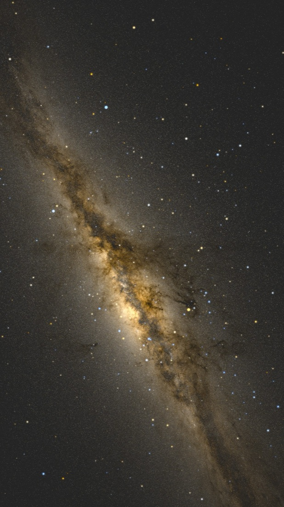
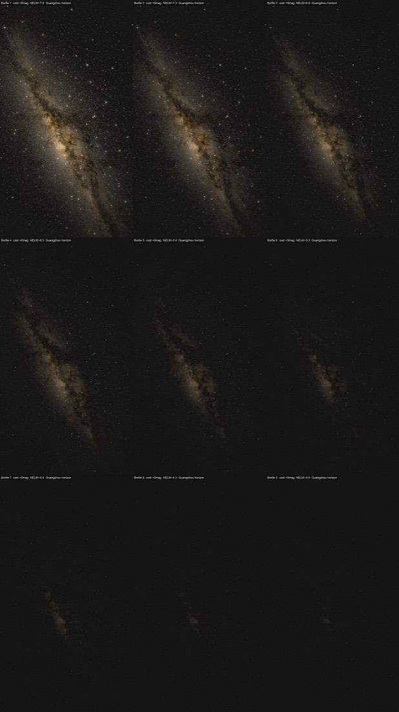
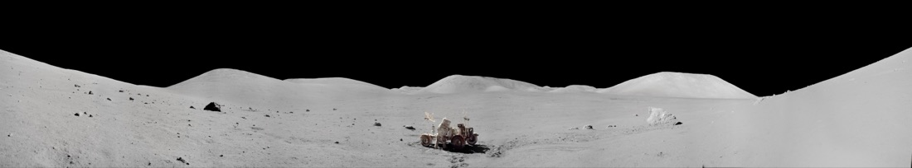
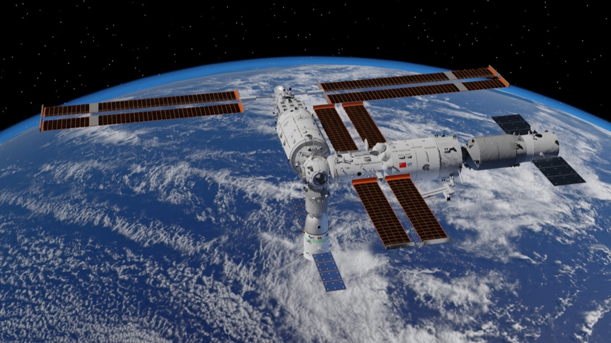

# 星空探索器 · 一场从「感动」到「上线」的旅程

> 从最早被鸭哥的项目击中，到把十几亿颗真实恒星搬进一个谁都能打开的网页。
> 这是 `cosmic-photo-explorer` 的完整历程。

---

## 缘起 · 被一张银河图击中（六月初）

一切的起点，是刷到了 **鸭哥（grapeot）** 的那篇文章——
《把 18 亿颗星星画在一张图上，能还原我们拍到的银河吗？》。

那种感觉很难说清。不是「哇好厉害」，而是**被击中**了：原来一个人可以拿欧空局 Gaia 卫星测出来的十几亿颗恒星的真实位置和亮度，一层一层地，把我们肉眼看到的那条银河，从数据里重新「显影」出来。

于是我把他的 `gaia_allsky` 仓库**下载了回来**，跟着一篇篇文章复现。那几天真的做出了东西：

- 低分辨率先验证——银河带在噪点里**涌现**，密度是背景的 10.4 倍；
- 高分辨率全天星图，124 万颗恒星，暗尘埃裂缝清清楚楚；
- HDR 线性星图，动态范围做到 **21510:1**（14.4 档光圈）。

最打动我的，是他那套**「翻车式」的做法**：先做一个最笨的版本，看它错在哪，再补一层机制；再看还差什么，再补一层。真实感不是一次画对的，是一次次翻车逼出来的。

我甚至把光污染的 Bortle 阶梯也复现了出来——同一片天，在城市和在荒野，眼睛能看见的完全是两回事。

**但是。**

复现归复现，我想做的其实是另一件事：一个**谁都能打开、能自己拖动探索**的星空网页。6 月 16 日我正式建了 `cosmic-photo-explorer` 这个仓库，还从鸭哥的文章里提炼出 7 个可复用的方法论。可真到要把它变成能用的产品那一步——**我不会用**。

计划里假设能直接复用鸭哥那套「离线渲染」的管线，结果那条路根本走不通：渲染是给出海报的，不是给人实时拖动的。项目卡在这里，「Phase 1 完成」其实是虚的。6 月 23 日只留下一个安全备份快照，然后……就搁下了。

一放，就是半个月。

---

## 第一幕 · 重启：换一条路（7 月 2 日傍晚）

7 月 2 日那个傍晚，趁着 **Fable** 重启，我决定把这个搁置了半个月的老计划捡回来。

这次想通了一件关键的事：**别再自己离线渲染了。** 天上的图，让专业的巡天服务实时给——用 CDS 的 **Aladin Lite** 加公共 HiPS 瓦片，直接把 ESA Gaia DR3 的真实全天图铺成一个能拖能缩的底图。

先做了个最小验证（Batch 0 spike），证明这条路真能跑通。然后，**一个晚上，39 个提交**，整个产品活了过来：

- **可交互星图**：真实的 Gaia 巡天底图，随手拖动、缩放；
- **10 个叙事锚点** + 夏季大三角连线 + 一键电影式导览；
- **双眼巡天对比**：放大到近景，两套巡天数据并排看；
- **观测台门户**：8 座望远镜，从哈勃、韦布到中国 FAST，每一座都有照片和新闻链接；

- **NASA 图库检索** + 站内灯箱查看；
- **深空探测器图层**：拿 JPL Horizons 的真实数据，把旅行者号们划过天空的轨迹画出来；
- **太阳系页面**：能真正放大到月球、火星的地表；
- **空间站页面**：3D 的国际空间站 + 天宫画廊；
- 还有几张**诚实的边界卡片**：Gaia 测的范围其实只是整个银河系的一小块；仙女座之所以特别，是因为它像一面照见我们自己的镜子。

当晚就**第一次部署上线** GitHub Pages，README 里郑重写上了对鸭哥的致谢——是他把我领进门的。

---

## 第二幕 · 打磨成一个真正的成品（7 月 3 日）

上线只是开始。第二天一整天，是把它从「能看」磨到「像个正经产品」。

**整站双语。** 写了一套 i18n 引擎，主站和所有子页面全部中英一键切换。中途还踩了两个坑：移动端的切换按钮不显示、静态子页面的脚本路径在子目录下加载不到——都一一修掉、分别上线。

**太阳系升级成 3D。** 画廊里的行星变成能 720° 旋转的球体；月球和火星更进一步，做成了**站在地表**的 360° 全景——真的像站在那片荒原上转一圈。

**自托管迁移。** 把 NASA 的行星照片、3D 模型引擎全搬到本地，砍掉所有外部 CDN 依赖——万一哪天国内打不开，它照样能用。顺手把一张 15MB 的光污染大图压到了 476KB。

**3D 星座——我最喜欢的一块。** 一个星座根本不是「一个东西」：北斗七星那七颗，其实散在几十到一百多光年的不同距离上，只是**恰好从地球看过去**连成了勺子。我把每颗星放到它真实的三维位置，站在地球（原点）看，是熟悉的勺子；镜头一转，勺子就**散架**了——因为它们本来就不在一起。先做了北斗，然后用同样的方法加上了**猎户座和仙后座**，配了个切换器。

### 刚刚的那个大 bug 🐛

就在快收工的时候，出事了。

主页那个可拖拽的银河大球**卡死**了——一碰整个页面锁死，按钮、滚轮全失灵，点了好几分钟才反应过来。

第一反应是押「静态银河秒开、想玩再点按钮加载」，做完直接被否——**真实可交互的底图才是这个项目的灵魂**，换成静态图等于把魂抽走了。而且按了按钮照样卡，说明根本没找到真凶。

回头重查，真凶是**探测器轨迹带**：5 条轨迹一共 16000 多个原始点，被当成实时折线，Aladin **每一帧都在主线程上重新投影、重新描一遍**——主线程被彻底钉死，整页冻住。

根治的办法是 **Douglas-Peucker 保形抽稀**：按形状简化，背景常驻只剩约 231 个顶点，既不卡、又不糊。可交互星图，**重新做回默认**。

顺手还调好了探测器的播放：**卫星贴身跟随**镜头、按角距离**匀速**推进（不再忽快忽慢）、播放时把卫星**钉在画面正中**（消掉了拖影）。至于「我们在地球上其实看到的是螺旋轨迹」这件反直觉的事，改成了右边一张**静态科普卡**慢慢讲——地图讲它真实怎么飞，卡片讲我们为什么看成螺旋。

当天反复上线七八次，直到最后一版。剩下的体验微调，都记进了 v2。

---

## 尾声 · 从「不会用」到「打开就能玩」

半个月前，我把鸭哥的项目下载回来，**却不会用**。

现在，任何人打开这个网址，都能拖动一张十几亿颗真实恒星的星图，飞到火星地表转一圈，看北斗七星在眼前散架，中英文随手切换——**而它是活的，是自己长出来的。**

回头看，真正做出来的从来不是那些渲染图。是**「学会怎么把它建起来」**这件事。鸭哥领进门，剩下的路，一步步自己走通了。

🌌 **它现在就在这里**：https://masaharulab.github.io/cosmic-photo-explorer/

---

### 数字里的这段路

| | |
|---|---|
| **总提交** | 85 个 commit |
| **真正的工作日** | 3 天（6/16 起念 · 7/2 重启 · 7/3 成品） |
| **爆发** | 最后约 30 小时里 68 个提交 |
| **上线** | 一晚首发，次日反复上线七八次 |
| **语言** | 中 / 英 全站双语 |
| **页面** | 主站 + 观测台 + 太阳系 + 空间站 + 3D 星座 + 数据来源 |
| **领进门的人** | 鸭哥（grapeot）· 致谢 🙏 |

*—— 一份写给这个项目的成长纪念。2026 年 7 月*
